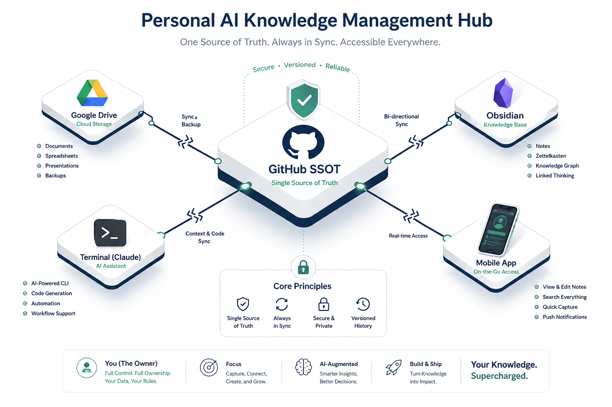
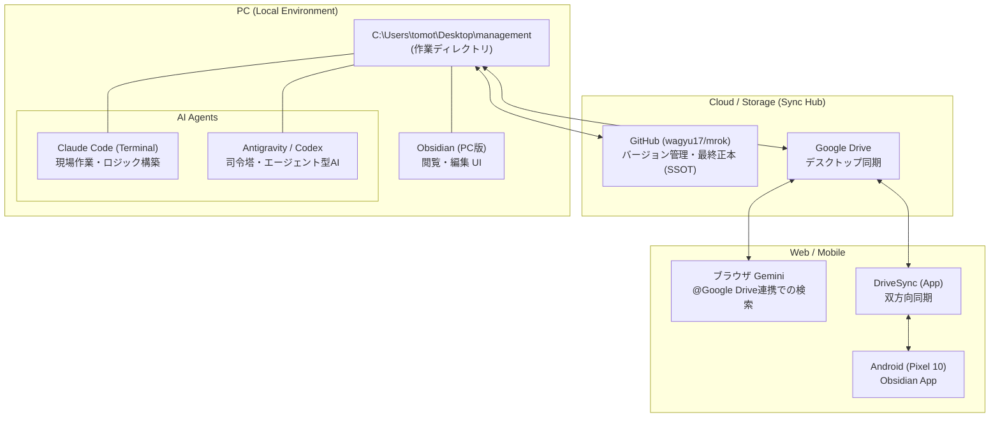

# AI Tools Ecosystem & Relationship (AIツール群の相関と特徴)

このドキュメントは、現在のシステムにおける主要なAIツール（Claude Code, Antigravity, Codex, Browser Gemini）の役割分担、特徴、およびデータ連携の仕組みをまとめたものです。
---

## 1. ツール間相関図 (Correlation Diagram)

GitHubを中央リポジトリ（SSOT）とし、Google Driveを介してローカルPC、Web AI、モバイル端末が同期される構造になっています。

---

## 2. 各AIツールの特徴と役割 (Characteristics & Roles)

| ツール名 | カテゴリ | 主な強み・特徴 | 主な用途 |
| :--- | :--- | :--- | :--- |
| **Claude Code** | ターミナル型 | CLIでの爆速操作、高度な論理思考、長文ドキュメントの精緻な解析。 | リポジトリ内の一括修正、データ解析、Git操作、エンジニアリング作業。 |
| **Antigravity** | エージェント型 | ブラウザ・ファイル・ターミナルを自律的に操る「パーソナル秘書」。 | 複雑なタスクの完遂、システムの構築・最適化、情報の統合整理。 |
| **Codex** | エディタ一体型 | エディタ内部（VS Code等）でのリアルタイム補完、即時的なコード修正。 | コーディング中の補完、インライン編集、ナレッジベース構築の伴走。 |
| **ブラウザ Gemini** | Web型 | Googleサービス（Drive等）との強力な連携、最新のネット検索、スマホ対応。 | 外出先からのファイル検索・参照、最新トレンドの調査、Googleアプリ連携。 |

---

## 3. データ連携とワークフロー (Workflow Rules)

1.  **SSOT (Single Source of Truth) の徹底**:
    *   すべての情報は `management` ディレクトリのMarkdownファイルに集約。
    *   GitHubが最終的な「正」であり、どのAIで作業しても最終的にここにプッシュされる。
2.  **デバイス間同期**:
    *   PCローカル ↔ Google Drive ↔ DriveSync ↔ Android (Obsidian) のルートで、場所を選ばず同じ情報を編集可能。
3.  **AIの呼び出しルール**:
    *   **現場作業（重い修正）** は Claude Code。
    *   **全体管理・自動化** は Antigravity。
    *   **執筆中の補助** は Codex。
    *   **移動中の確認・調査** は Gemini。

---

## 4. 具体的活用例：陸上競技トレーニング管理 (Use Case: Athletics Training)

「客観性と事実ベース」の原則に基づき、AIエコシステムを以下のように循環させます。

1.  **計画 (Theory-Driven Planning)**:
    *   **Antigravity**: 最新の生理学的理論（閾値トレーニング等）をリサーチし、戦略の骨子を作成。
    *   **Claude Code**: PR（自己ベスト）に基づき、VODT等を用いた1秒単位の正確な設定ペースを算出。
2.  **記録 (Hybrid Logging)**:
    *   **Garmin/CSV**: 客観的な数値データ（心拍、ペース、ピッチ）を `更新用トレーニングログ` に自動集約。
    *   **Obsidian**: RPE（主観的強度）やGIストレス、睡眠、食事等の「感覚データ」を構造化して記録。
3.  **分析 (Data-Driven Feedback)**:
    *   **Claude Code**: CSVデータと主観ログを統合解析。「なぜDNFしたのか」「心拍ドリフトの原因は何か」等の因果関係を特定。
4.  **レビュー (Mobile Review)**:
    *   **ブラウザ Gemini**: 練習直前にスマホから `@Google Drive` 経由で計画を確認し、当日の体調に合わせた微調整（プランB）を相談。

---
最終更新: 2026-05-11
